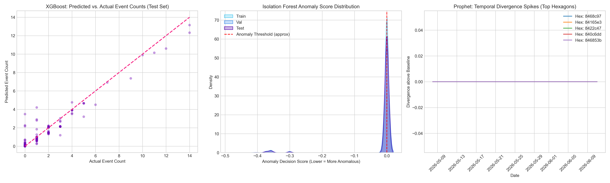

# 🌍 Spatio-Temporal Outbreak Detection System

A real-time geospatial machine learning pipeline for detecting and forecasting seismic event outbreaks using H3 hexagonal spatial indexing, an ensemble of three ML models, and an interactive Streamlit dashboard.

---

## 🔗 Live Demo

👉 **[View the Live Dashboard](https://diditshake.streamlit.app)**



---

## 📌 Project Overview

This project builds a complete **end-to-end spatio-temporal crisis detection system** that monitors seismic activity, identifies geographic anomalies, and forecasts future risk zones on a global scale.

The system aggregates raw seismic events into **Uber H3 hexagonal cells** (Resolution 4, ~500km diameter) and then feeds a 30-day rolling feature matrix through a three-model ensemble:

| Model | Role | Question Answered |
|---|---|---|
| **Isolation Forest** | Spatial Anomaly Detection | *Where is an anomaly happening right now?* |
| **XGBoost Regressor** | Short-Term Risk Forecasting | *How many events should we expect tomorrow?* |
| **Facebook Prophet** | Temporal Baseline Divergence | *Is this hexagon diverging from its long-term baseline?* |

---

## 🏗️ Pipeline Architecture

```
Raw Seismic Data (USGS)
         │
         ▼
01_data_ingestion_eda.ipynb     → EDA, cleaning, train/val/test splits
         │
         ▼
02_spatial_aggregation.ipynb    → H3 hexagonal binning (res 4), neighbor indexing
         │
         ▼
03_feature_engineering.ipynb    → Lag features, rolling stats, neighbor pressure index
         │
         ▼
04_ml_pipeline.ipynb            → Isolation Forest + XGBoost + Prophet ensemble
         │
         ▼
05_interactive_dashboard.ipynb  → Lonboard GPU-accelerated in-notebook map
         │
         ▼
app.py (Streamlit)              → Public-facing interactive web dashboard
```

---

## 📊 Model Performance

### Isolation Forest (Anomaly Detection)
| Split | Anomaly Rate | Avg Score |
|---|---|---|
| Train | 4.21% (18,513 hexes) | -0.0149 |
| Validation | 4.35% (6,323 hexes) | -0.0155 |
| Test | 3.60% (5,080 hexes) | -0.0127 |

### XGBoost Regressor (Event Count Forecasting)
| Split | MAE | RMSE | R² |
|---|---|---|---|
| Train | 0.0010 | 0.0202 | **0.9896** |
| Validation | 0.0023 | 0.1732 | 0.6314 |
| Test | 0.0009 | 0.0237 | **0.9706** |

### Prophet (Temporal Divergence, Top 20 Hexagons)
| Split | Anomaly Detections | Max Divergence |
|---|---|---|
| Train | 117 | 53.08 |
| Validation | 34 | 64.30 |
| Test | 28 | 13.62 |

---

## 🖥️ Interactive Streamlit Dashboard

The dashboard provides real-time interactive exploration of the ML outputs:

- **📅 Date Slider** — Scrub through the 30-day timeline in the sidebar
- **📈 KPI Cards** — Live metrics: active anomaly cells, predicted next-day cases, monitored regions
- **🗺️ Geospatial Map** — PyDeck `H3HexagonLayer` rendering hexagonal risk zones globally (🔴 Red = anomaly, 🔵 Blue = safe)
- **📉 Trend Chart** — Plotly dual-line chart of actual vs. XGBoost predicted cases over time

---

## 🚀 Running Locally

### 1. Clone the Repository
```bash
git clone https://github.com/Rohit100z/spatio-temporal-outbreak-detection.git
cd spatio-temporal-outbreak-detection
```

### 2. Install Dependencies
```bash
pip install -r requirements.txt
```

### 3. Launch the Dashboard
```bash
streamlit run app.py
```

The dashboard will open at `http://localhost:8501`.

---

## 📓 Running the Full Pipeline (Notebooks)

Run notebooks in order from the `notebooks/` directory:

| Notebook | Description |
|---|---|
| `01_data_ingestion_eda.ipynb` | Data loading, EDA, and train/val/test splitting |
| `02_spatial_aggregation.ipynb` | H3 hexagonal aggregation and neighbor indexing |
| `03_feature_engineering.ipynb` | Lag features, rolling stats, and feature matrix creation |
| `04_ml_pipeline.ipynb` | Model training, evaluation, and MLflow tracking |
| `05_interactive_dashboard.ipynb` | GPU-accelerated in-notebook Lonboard visualization |

---

## 🗂️ Project Structure

```
spatio-temporal-outbreak-detection/
├── app.py                          # Streamlit dashboard (main entry point)
├── requirements.txt                # Python dependencies
├── notebooks/
│   ├── 01_data_ingestion_eda.ipynb
│   ├── 02_spatial_aggregation.ipynb
│   ├── 03_feature_engineering.ipynb
│   ├── 04_ml_pipeline.ipynb
│   ├── 05_interactive_dashboard.ipynb
│   ├── ml_pipeline_test_results.csv  # Final ML outputs (used by app.py)
│   └── model_evaluation_comparisons.png
├── src/                            # Helper modules
└── .gitignore
```

---

## 🛠️ Tech Stack

| Category | Technology |
|---|---|
| **Language** | Python 3.13 |
| **Data Processing** | Pandas, Polars, NumPy |
| **Spatial Indexing** | Uber H3 (Resolution 4) |
| **ML Models** | Scikit-learn, XGBoost, Prophet |
| **Experiment Tracking** | MLflow |
| **Visualization (notebook)** | Lonboard, Matplotlib |
| **Visualization (app)** | PyDeck, Plotly |
| **Dashboard** | Streamlit |

---

## 📄 License

This project is licensed under the MIT License.

---

*Built as a spatio-temporal crisis detection research project. Data sourced from USGS Earthquake Catalog.*
